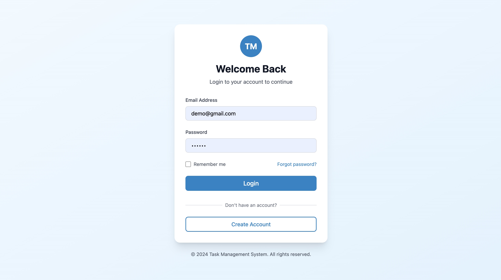
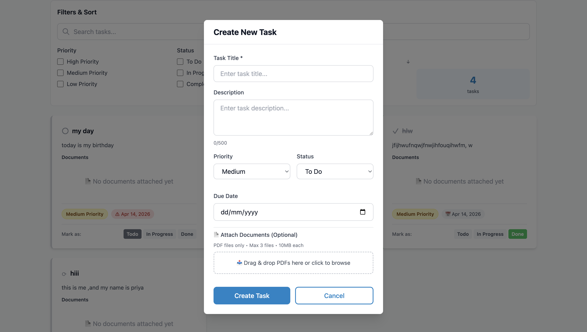
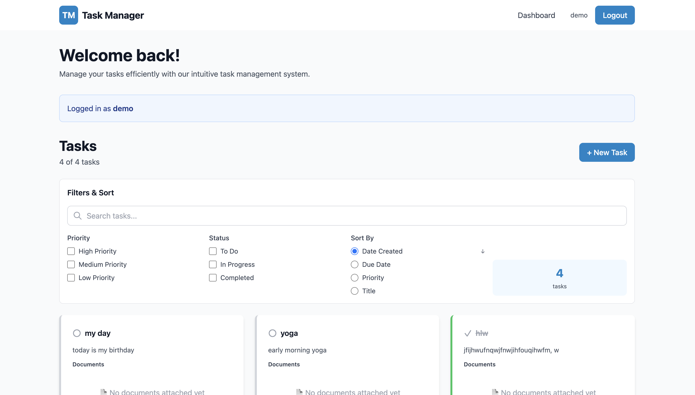

# Task Management System

A complete full-stack web application for managing tasks with user authentication, featuring a React frontend with TailwindCSS and a Node.js/Express backend with MongoDB.
---

## Screenshots

### Login Page

*User authentication with email and password*

### Register Page

*Create new user account with validation*

### Dashboard

*Task management interface with create, view, and delete operations*

---

## Quick Start Guide

### Local Development Setup (3 Steps)

**Step 1: Backend Setup**
```bash
cd backend
npm install
npm run dev
```

**Step 2: Frontend Setup (New Terminal)**
```bash
cd frontend
npm install
npm run dev
```

**Step 3: Open Browser**
```
http://localhost:3000
```

Register, login, and start creating tasks!

---

## Docker Deployment

### Quick Docker Start (Alternative to Local Setup)

**Prerequisites:**
- Docker (version 20.10 or higher)
- Docker Compose (version 1.29 or higher)

**Run One Command:**
```bash
docker-compose up -d --build
```

**Check Services:**
```bash
docker-compose ps
```


### Docker Services Overview

**MongoDB**
- Port: 27017
- Username: root
- Password: password
- Database: task_management_system
- Data persists in mongodb_data volume

**Backend (Node.js/Express)**
- Port: 5000
- Environment: production
- Runs on npm start
- Health check endpoint: /api/health
- File uploads: /app/uploads

**Frontend (React/Vite)**
- Port: 3000
- Multi-stage optimized Docker build
- API proxy routes to backend:5000

### Docker Common Commands

```bash
# View logs for all services
docker-compose logs -f

# View specific service logs
docker-compose logs -f backend
docker-compose logs -f frontend
docker-compose logs -f mongodb

# Stop all services
docker-compose down

# Stop and remove volumes
docker-compose down -v

# Rebuild specific service
docker-compose build --no-cache backend

# View running containers
docker-compose ps
```

### Docker Production Deployment

**Using Environment File:**
```bash
# Create .env.production with secure values
docker-compose up -d --env-file .env.production
```

**Backup MongoDB Data:**
```bash
docker-compose exec mongodb mongodump --out /data/backup
docker cp task-management-mongodb:/data/backup ./backups
```

**Port Already in Use:**
```bash
# Find and kill process
lsof -i :5000
kill -9 <PID>

# Or change port in docker-compose.yml
```

**Clear Everything and Restart:**
```bash
docker-compose down -v
docker system prune -a
docker-compose up -d --build
```

---

## Features

### Backend (Port 5000)
- RESTful API with Express
- User authentication (Register/Login)
- Task CRUD operations
- JWT token-based security
- MongoDB integration
- 66+ comprehensive tests with 82% coverage
- Production-ready code
- File upload support
- Input validation and error handling

### Frontend (Port 3000)
- React 18 with Vite build tool
- Beautiful UI with TailwindCSS
- Three ready-made pages:
  - Login page with authentication
  - Register page for account creation
  - Dashboard for task management
- React Router with protected routes
- Responsive design (mobile, tablet, desktop)
- Real-time API integration
- Form validation and error handling

### Core Functionality
- User registration with email and password
- Secure user login and session management
- Create new tasks with title and description
- Set task priority (High, Medium, Low)
- Manage task status (To Do, In Progress, Completed)
- View all tasks in organized grid layout
- Delete tasks
- View task statistics
- File attachment support
- Logout functionality

---

## Technology Stack

### Frontend
- React 18.2 - UI framework
- Vite 5.0 - Lightning-fast build tool
- React Router 6.20 - Client-side routing
- TailwindCSS 3.4 - CSS framework
- Axios 1.6 - HTTP client
- ESLint 8.55 - Code quality

### Backend
- Express 4.18 - Web framework
- MongoDB 7.0+ - NoSQL database
- Mongoose 7.8 - MongoDB ODM
- JWT - Token authentication
- bcryptjs - Password hashing
- Multer - File upload handling
- Jest 29 - Testing framework
- Node.js 18+ - Runtime environment

---

## API Endpoints

### Authentication
```
POST   /api/auth/register      Create user account
POST   /api/auth/login         User login
GET    /api/auth/me            Get current user profile
POST   /api/auth/logout        User logout
```

### Tasks
```
GET    /api/tasks              Get all tasks (protected)
POST   /api/tasks              Create new task (protected)
PUT    /api/tasks/:id          Update task (protected)
DELETE /api/tasks/:id          Delete task (protected)
GET    /api/tasks/stats        Get task statistics (protected)
```

### Files
```
POST   /api/files/:taskId/upload    Upload files to task
GET    /api/files/:taskId           Get all files for task
DELETE /api/files/:fileId           Delete specific file
GET    /api/files/:fileId/download  Download file
```

---

## Local Development Setup

### Requirements
- Node.js 18 or higher
- npm 9 or higher
- MongoDB 6.0 or higher (local or Atlas)
- Git

### Backend Installation

```bash
cd backend
npm install
```


Run development server:
```bash
npm run dev
```

Backend runs on: http://localhost:5000

### Frontend Installation

```bash
cd frontend
npm install
```

Create `.env` file:
```env
VITE_API_URL=http://localhost:5000
```

Run development server:
```bash
npm run dev
```

Frontend runs on: http://localhost:3000

---

## Testing

### Backend Tests
```bash
cd backend

# Run all tests
npm test

# Watch mode
npm run test:watch

# Coverage report
npm run test:coverage
```

Results: 66+ tests passing, 82% code coverage

### Frontend Linting
```bash
cd frontend

# Run linter
npm run lint
```

---


## Database Schema

### Users Collection
```javascript
{
  _id: ObjectId,
  email: String (unique),
  password: String (hashed),
  role: String (user or admin),
  isActive: Boolean,
  lastLogin: Date,
  createdAt: Date,
  updatedAt: Date
}
```

### Tasks Collection
```javascript
{
  _id: ObjectId,
  title: String (required),
  description: String,
  priority: String (low, medium, high),
  status: String (pending, in-progress, completed),
  completed: Boolean,
  assignedTo: ObjectId (ref: User),
  createdBy: ObjectId (ref: User),
  category: String,
  dueDate: Date,
  createdAt: Date,
  updatedAt: Date
}
```

### Files Collection
```javascript
{
  _id: ObjectId,
  filename: String,
  originalName: String,
  filepath: String,
  mimetype: String (application/pdf),
  size: Number,
  task: ObjectId (ref: Task),
  uploadedBy: ObjectId (ref: User),
  description: String,
  createdAt: Date,
  updatedAt: Date
}
```

---

## Security Features

- Password hashing with bcryptjs
- JWT token authentication
- Protected API routes with middleware
- CORS configuration
- Input validation on all endpoints
- Error handling and sanitization
- Secure token storage
- Protected file uploads
- Rate limiting ready

---

## Usage Guide

### Register New Account
1. Go to http://localhost:3000
2. Click "Create Account"
3. Enter name, email, password, and confirm password
4. Click "Register"

### Login to Account
1. Go to http://localhost:3000/login
2. Enter email and password
3. Click "Sign In"

### Create Task
1. In Dashboard, enter task title
2. Add description (optional)
3. Set priority level
4. Set task status
5. Click "Create Task"

### Attach Files
1. When creating a task, select PDF files
2. Maximum 3 files per task
3. Maximum 10MB per file
4. Files auto-upload with task

### Manage Tasks
1. View all tasks in grid layout
2. See priority and status badges
3. Delete tasks with confirmation
4. View task statistics in sidebar
5. Download attached files
6. Logout when finished

---

## Troubleshooting

### Port Already in Use
```bash
# Backend port 5000
kill -9 $(lsof -t -i:5000)

# Frontend port 3000
kill -9 $(lsof -t -i:3000)
```

### MongoDB Connection Failed
- Ensure MongoDB is running locally on port 27017
- Or update MONGODB_URI to your MongoDB Atlas connection string
- Check .env file has correct MONGODB_URI

### API Connection Error
- Verify backend is running on port 5000
- Check frontend proxy in vite.config.js
- Check browser console for error messages
- Verify CORS_ORIGIN matches frontend URL

### Styles Not Loading
```bash
cd frontend
rm -rf dist node_modules
npm install
npm run dev
```

### Build Errors
```bash
# Clear cache
cd backend && npm cache clean --force
cd frontend && npm cache clean --force

# Reinstall
npm install

# Run again
npm run dev
```

---
## Performance Features

- Vite: Ultra-fast build tool and dev server
- Hot Module Replacement (HMR): Instant code updates
- Code splitting: Automatic optimization
- TailwindCSS: Minimal CSS output
- API proxy: Seamless development
- Production-optimized builds
- MongoDB indexing for query performance
- JWT token caching
- File compression ready

---

## Project Statistics

| Metric | Count |
|--------|-------|
| Total Files | 40+ |
| React Components | 4+ |
| Page Components | 3 |
| API Endpoints | 11 |
| Backend Tests | 66+ |
| Test Coverage | 82% |
| Lines of Code | 3400+ |
| npm Dependencies | 390+ |
| Documentation Lines | 3000+ |

---

## Project Status

Production Ready - All Features Complete

| Component | Status |
|-----------|--------|
| Backend | Complete |
| Frontend | Complete |
| Testing | 66+ tests passing |
| Documentation | Complete |
| Docker | Ready for deployment |
| Ready to Use | YES |
| Ready to Deploy | YES |

---


